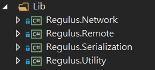
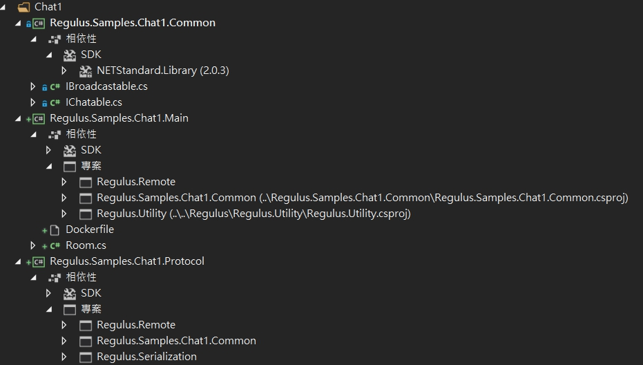
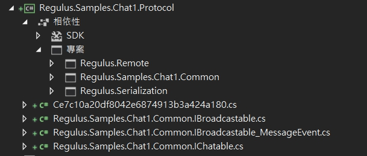

# 教學說明
以下範例為介紹如何建立起一個聊天室專案。
## 功能開發
### 1.引入程式庫  
  
### 2.建立主專案檔案結構  
  
Common - Client 與 Server 的共通定義。  
Main - 聊天室的主要邏輯。   
Protocol - 空專案，目的是產生共通物件定義的實作。  
## 建立 Protocol
此步驟為建立 Client 與 Server 之間協定程式碼。 執行期需要它。  
使用 **Regulus.Application.Protocol.CodeWriter** 產生程式碼到 Regulus.Samples.Chat1.Protocol 。  
建立 Directory.Build.targets 內容如下。  
``` xml
<Project>
    <Target Condition="'$(ProjectName)'=='Regulus.Samples.Chat1.Common' And '$(SolutionDir)'!='*Undefined*'" Name="CreateProtocol" BeforeTargets="Build">
        <Exec Command="del $(SolutionDir)Chat1\Regulus.Samples.Chat1.Protocol\*.cs /q"/>
        <Exec Command="dotnet run --project $(SolutionDir)/Regulus/Regulus.Application.Protocol.CodeWriter  --common $(TargetPath) --output $(SolutionDir)\Chat1\Regulus.Samples.Chat1.Protocol" />
    </Target>
</Project>
```  
之後當編譯 **Regulus.Samples.Chat1.Common** 時會自動產生程式碼。  
  


## 執行
Client  
```
C:\Regulus.Samples> dotnet run --project .\Regulus\Regulus.Application.Client --protocol .\Chat1\Regulus.Samples.Chat1.Protocol\bin\Debug\netstandard2.0\Regulus.Samples.Chat1.Protocol.dll
```
Server  
```
C:\Regulus.Samples> dotnet run --project .\Regulus\Regulus.Application.Server --port 53771 --protocol .\Chat1\Regulus.Samples.Chat1.Protocol\bin\Debug\netstandard2.0\Regulus.Samples.Chat1.Protocol.dll --entryname Regulus.Samples.Chat1.Main.Room --entry .\Chat1\Regulus.Samples.Chat1.Main\bin\Debug\netstandard2.0\Regulus.Samples.Chat1.Main.dll
```


